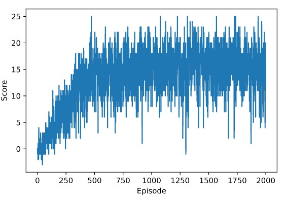

# Report: Navigation

### by Matthias Busse
---

## Deep Reinforcement Learning Algorithm DQN

The algorithm used for solving the Unity banana environment (modified by Udacity) is a simplified version of the one as decribed in
[Human level control through deep reinforcement learning](https://storage.googleapis.com/deepmind-media/dqn/DQNNaturePaper.pdf). It has been developed by Google Deepmind to solve atari games and the letter has been published in NATURE in 2015.

The agent learns which action to take best for any given state of the environment. During training it has gone through many episodes of the game, keeping track of the total reward it received. The expected discounted reward (discount controlled by hyperparameter gamma), calculated at any given timestep and for any possible action are called action values and they are stored and updated at every timestep in a socalled Q-table (this a socalled temporal difference (TD) control method). The action values as a function of the continuous state space are being approximated by a non-linear (ReLu activation functions) fully connected neural network. The implemented method of socalled Q-Learning, or Sarsamax, is an off-policy TD control method, which means it can update the highest action value and not only the action-value the agent has experienced (by the policy which has chosen an action). This leads to a faster convergence to the optimal policy. 

During training the algorithm follows an epsilon greedy policy (which it tries to optimise) to choose the next action. It is a combination of exploiting what the agent has learned so far (taking the action which yields the highest expected reward) and exploration to discover new possibilities, actions at given states, that might yield even higher rewards. With a probability controlled by the hyperparameter epsilon the policy chooses either a greedy action or an explorative action. Epsilon decays over time (number of episodes during training). So in the beginning the agent explores more and after a while it can rely on its experience and take more and more greedy actions.

The DQN algorithm also uses a method called experience replay. This means it continuously stores its experiences (tuples of state, action, reward) in a large buffer. After a defined number of timesteps, a batch of experiences is randomly sampled from the buffer and the model weights are updated based on these experiences.
In addition the algorithm uses socalled fixed Q-targets to avoid harmful correlations (as we update a guess with a guess in classical Q-learning). The target Q-Network's weights are updated less often than the primary Q-Network.

## Neural network architecture
The neural network (NN) consists of 3 layers (2 hidden and 1 output layer) with 64 hidden units (neurons) each.
A non-linear ReLu function is used for activation.
The NN takes the 37 states as input and outputs 4 action values.
Using more hidden units didn't improve the result.

## Chosen hyperparameters

| Hyperparameter | Value | Comment |
| --- | --- | --- |
| Number of episodes | 2000 | Maximum number of episodes to train the agent
| $\gamma$ | 0.99 | Discount factor of future rewards |
| Learning rate | 0.0005 | Learning rate used by neural network optimiser Adam
| $\epsilon$ start | 1.0 | Value of $\epsilon$ greedy policy evaluation at first episode (maximum exploration)
| $\epsilon$ end | 0.01 | Minimum value of $\epsilon$ greedy policy evaluation after decay (maximum exploitation)
| $\epsilon$ decay rate | 0.995 | Decay of $\epsilon$ over number of episodes
| batch size | 64 | Number of experienced tuples (state, actions, rewards, next state) sampled for experience replay 
| buffer size | 100000 | Number of most recent experienced tuples
| update frequency | 4 | Model weights of target Q-network are updated every 4th timestep
| $\tau$ | 0.0001 | Soft update of target weights $\theta_{target} = \theta_{target} + \tau \theta_{local}$
| Max_T | 1000 | Maximum number of timesteps per episode

Most of the hyperparameters chosen like in the lunar lander environment.
$\epsilon$ end = 0.1 and learning rate = 0.001 did not lead to higher final score.

## Plot of rewards
After 398 an average score of 13 was achieved. After 1500 episodes the average score reached 16.06. Final average score after 2000 episodes: 14.99.

## Ideas for future work

The algorithm's performance can potentially be improved by trying the following modifications:

- [Double DQN](https://arxiv.org/abs/1509.06461)
- [Dueling DQN](https://arxiv.org/abs/1511.06581)
- [Prioritized experience replay](https://arxiv.org/abs/1511.05952)
- [Noisy Networks for Exploration](https://arxiv.org/abs/1706.10295)
- [A Distributional Perspective on Reinforcement Learning](https://arxiv.org/abs/1707.06887)
- [Asynchronous Methods for Deep Reinforcement Learning](https://arxiv.org/abs/1602.01783)

Each addresses a different issue.

A combination of all 6 of them was tested by researchers at Google DeepMind. The corresponding algorithm was termed [Rainbow](https://arxiv.org/abs/1710.02298) and it outperformed each of the individual modifications.

